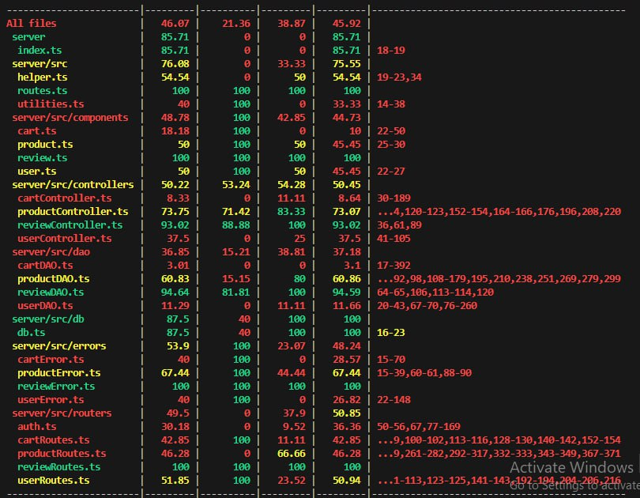

# Test Report

The goal of this document is to explain how the EzElectronics application was tested, detailing how the test cases were defined and what they cover.

## Contents

- [Test Report](#test-report)
- [Contents](#contents)
- [Dependency graph](#dependency-graph)
- [Integration approach](#integration-approach)
- [Tests](#tests)
- [Coverage](#coverage)
  - [Coverage of FR](#coverage-of-fr)
  - [Coverage white box](#coverage-white-box)

## Dependency graph

> A dependency graph for EzElectronics would be visualized here. Assuming integration of multiple modules like User, Product, and Review modules, dependencies are likely based on database interactions and service dependencies.

## Integration approach

## Tests

| Test case name                                      | Object(s) tested                     | Test level      | Technique used                    |
|-----------------------------------------------------|--------------------------------------|-----------------|-----------------------------------|
| Successfully registers new products                 | Product registration                 | Integration     | Boundary values, Happy path       |
| ProductAlreadyExistsError handling                  | Product registration error           | Integration     | Exception paths, Error handling   |
| Validate product registration parameters            | Product registration parameters      | Integration     | Boundary values                   |
| Successfully retrieves product reviews              | Review retrieval                     | API             | Black box, Happy path             |
| Successfully deletes all reviews for a product      | Review deletion for a product        | API             | Black box, Path testing           |
| Successfully deletes all reviews                    | Review deletion                      | API             | Black box, Path testing           |
| Successfully updates product quantity              | Product quantity update              | Integration     | Boundary values, Happy path       |
| Successfully sells a product                        | Product sale                          | Integration     | Boundary values, Happy path       |
| Successfully shows list of all products             | List all products                    | API             | Black box, Path testing           |
| Successfully shows list of all available products   | List all available products          | API             | Black box, Path testing           |
| Successfully shows list of products by category     | List products by category            | API             | Black box, Path testing           |
| Successfully shows list of available products by category | List available products by category | API             | Black box, Path testing      |
| Successfully shows list of products by model        | List products by model               | API             | Black box, Path testing           |
| Successfully shows list of available products by model | List available products by model    | API             | Black box, Path testing         |
| Successfully deletes a product                      | Delete product                       | API             | Boundary values, Error handling   |
| Successfully deletes all products                   | Delete all products                  | API             | Boundary values, Error handling   |
| Successfully adds a new review to a product         | Add new review to product            | API             | Black box, Happy path             |
| Product reviews retrieval by product model          | Retrieve reviews by product model    | API             | Black box, Path testing           |
| Successfully deletes a review for a product         | Delete review for product            | API             | Black box, Path testing           |
| Successfully deletes all reviews for a product      | Delete all reviews for a product     | API             | Black box, Path testing           |
| Successfully deletes all reviews for all products   | Delete all reviews for all products  | API             | Black box, Path testing           |

### Coverage of FR

| Functional Requirement or scenario                        | Test(s)                                     |
|-----------------------------------------------------------|---------------------------------------------|
| FR3.1 Register a set of new products                   | Successfully registers new products, ProductAlreadyExistsError handling, Validate product registration parameters |
| FR3.2 Update the quantity of a product                | Successfully updates product quantity       |
| FR3.3 Sell a product                                   | Successfully sells a product                |
| FR3.4 Show the list of all products                    | Successfully shows list of all products     |
| FR3.4.1 Show the list of all available products        | Successfully shows list of all available products |
| FR3.5 Show the list of all products with the same category | Successfully shows list of products by category |
| FR3.5.1 Show the list of all available products with the same category | Successfully shows list of available products by category |
| FR3.5 Show the list of all products with the same model | Successfully shows list of products by model |
| FR3.5.1 Show the list of all available products with the same model | Successfully shows list of available products by model |
| FR3.7 Delete a product                                  | Successfully deletes a product              |
| FR3.8 Delete all products                               | Successfully deletes all products           |
| FR4.1 Add a new review to a product                     | Successfully adds a new review to a product |
| FR4.2 Get the list of all reviews assigned to a product | Successfully retrieves product reviews     |
| FR4.3 Delete a review given to a product                | Successfully deletes a review for a product |
| FR4.4 Delete all reviews of a product                   | Successfully deletes all reviews for a product |
| FR4.5 Delete all reviews of all products                | Successfully deletes all reviews for all products |

