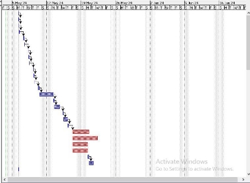
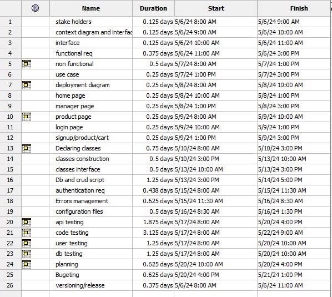
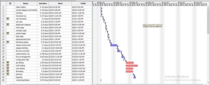

 Estimation Document V1

Project Estimation - CURRENT

Date:        5 mag 2024 Version:    **V1.5**

Estimation Approach 

Consider the EzElectronics project in CURRENT version (as given by the teachers), assume that you are going to develop the project INDEPENDENT of the deadlines of the course, and from scratch.

1. Estimate by size 

||Estimate|
| :- | - |
|NC = Estimated number of classes to be developed|19|
|A = Estimated average size per class, in LOC|85|
|S = Estimated size of project, in LOC (= NC \* A)|1615|
|E = Estimated effort, in person hours (here use productivity 10 LOC per person hour)|162|
|C = Estimated cost, in euro (here use 1 person hour cost = 30 euro)|4860|
|Estimated calendar time, in calendar weeks (Assume team of 4 people, 8 hours per day, 5 days per week)|
1 week

5 days of work
|

2. Estimate by product decomposition 

|Component Name|Estimated effort (person hours)|
| - | - |
|Requirement document|34|
|GUI prototype|8|
|Design document|30|
|Code|112|
|Unit tests|65|
|API tests|10|
|Management documents|25|

3. Estimate by activity decomposition 

Activity Name Estimated effort (person hours) 1- Requirement doc Tot. 46

`      `Stakeholders 2

`      `Context diagram 1

`      `Interfaces 2

`      `Functional req 12

`      `Non function req 15

`      `Use cases 8       Deployment diagram 6

2- GUI prototype Tot. 11.5       Home page                           22

`      `Manager page 1.5

`      `Products page 2

`      `Login page  2

`      `Signup page 1

`      `Product specification  1

`      `Cart 2

3- Coding Tot. 148        Declaring classes 25

`       `Classes constructors 15

`       `Classes interfaces 18

`       `Db and crud scripts 40

`       `Authentication req 15

`       `Errors management 20

`       `Configuration files(json) 15

4- Testing Tot. 65        API testing 15

`       `Code testing 25

`       `User testing  15

`       `DB testing 10

5- Management doc Tot. 36        Planning 10

`       `Budgeting 15

`       `Tracking 5

`       `Versioning 4

`        `Release 2

Grantt Chart

(see granChartt.prod file in repository) Below you can see snapshots of it.

**Grantt stacked bar Chart**

**Schedule Table**

**Full view of Grantt Chart development**

Summary 

Here we report the results of the three estimation approaches. The estimates may differ. Discuss here the possible reasons for the difference

||Estimated effort|Estimated duration|
| :- | - | - |
|estimate by size|162|40 hours (1 week)|
|estimate by product decomposition|284|71 hours (8-9 days)|
|estimate by activity decomposition|306\.5|76\.5 (9-10) days|

The difference between the 3 estimations, is because of the different approaches.

In the first approach, we don't think about the details, we only calculate the effort and the duration needed from the lines of code estimated to be written. while in the second approach we compute the duration by decomposing the product, finally in the 3rd approach we estimated the effort and the duration by estimating the time needed to finish each activity.
