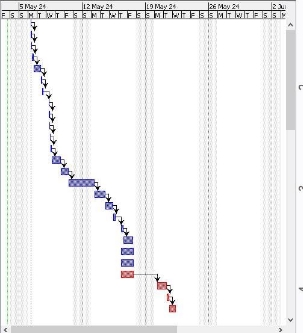
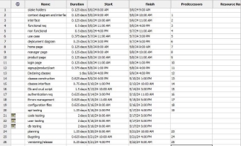
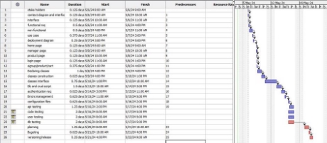

 Estimation Document

Project Estimation - CURRENT 

Date:  5 mag 2024 Version:  **V2.1**

Estimation Approach 

Consider the EzElectronics project in CURRENT version (as given by the teachers), assume that you are going to develop the project INDEPENDENT of the deadlines of the course, and from scratch.

1. Estimate by size 

||Estimate|
| :- | - |
|NC = Estimated number of classes to be developed|24|
|A = Estimated average size per class, in LOC|83|
|S = Estimated size of project, in LOC (= NC \* A)|1992|
|E = Estimated effort, in person hours (here use productivity 10 LOC per person hour)|200|
|C = Estimated cost, in euro (here use 1 person hour cost = 30 euro)|6000|
|Estimated calendar time, in calendar weeks (Assume team of 4 people, 8 hours per day, 5 days per week)|9 days|

2. Estimate by product decomposition 

|Component Name|Estimated effort (person hours)|
| - | - |
|Requirement document|40|
|GUI prototype|12|
|Design document|35|
|Code|140|
|Unit tests|75|
|API tests|18|
|Management documents|30|

3. Estimate by activity decomposition

Activity Name Estimated effort (person hours) 1- Requirement doc Tot. 61

`      `Stakeholders 4

`      `Context diagram 2

`      `Interfaces 4

`      `Functional req 15

`      `Non function req 18

`      `Use cases 10

`      `Deployment diagram 8

2- GUI prototype Tot. 16.5       Home page                           2

`      `Manager page 1.5

`      `Products page 4

`      `Login page  2

`      `Signup page 1

`      `Product specification  4       Cart 2

3- Coding Tot. 176      Declaring classes 30

`     `Classes constructors 20

`     `Classes interfaces 22

`     `Db and crud scripts 46

`     `Authentication req 20

`     `Errors management 20

`     `Configuration files(json) 18

4- Testing Tot. 77       API testing 15

`      `Code testing 30

`      `User testing  20

`      `DB testing 12

5- Management doc Tot. 41      Planning 12

`     `Budgeting 18

`     `Tracking 5

`     `Versioning 4

`      `Release 2

Grantt Chart 

(see granChartt.prod file in repository) Below you can see snapshots of it.

**Grantt stacked bar Chart**

**Schedule Table**

**Full view of Grantt Chart development**

Summary 

Here we report the results of the three estimation approaches. The estimates may differ. Discuss here the possible reasons for the difference

||Estimated effort|Estimated duration|
| :- | - | - |
|estimate by size|200|9 days |
|estimate by product decomposition|350|87\.5 hours (15 days)|
|estimate by activity decomposition|371|16 days|

The difference between the 3 estimations, is because of the different approaches.

In the first approach, we don't think about the details, we only calculate the effort and the duration needed from the lines of code estimated to be written. while in the second approach we compute the duration by decomposing the product, finally in the 3rd approach we estimated the effort and the duration by estimating the time needed to finish each activity.
