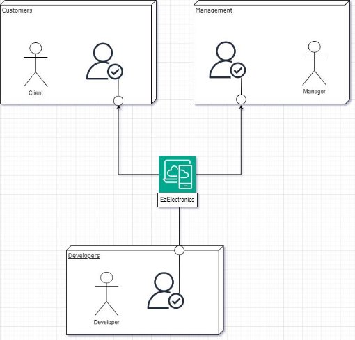

 Requirements Document

 Project Scope 

|**Name**|EzElectronics|
| - | - |
|**State**|**COMPLETED**|
|**Version**|1\.5|
|**Owners**|Group 19|
|**Document Scope**|Conduct analysis of the existing server code to extract its underlying architecture and functionalities. Subsequently translating these into a comprehensive Requirements document and a GUI prototype.|
|**Details**|
EZElectronics serves as a comprehensive software solution tailored for Electronics store management. It manages product inventory, customer transactions,… via a dedicated web platform. It allows customers to review existing products, add new ones, and validate purchases. 

This application provides a seamless experience to browse available products, add desired items to your virtual cart, and access a detailed history of your past purchases.
|
|**Users**|
1. Store Managers: Purchase large Order, manage inventory.

2. Customers which can be:

a. Buying at the store.

b. Purchasing products online.
|
|**Use case scenarios**|
 Inventory management;

 Customer transaction recording;

 Product browsing;

 Cart management;

 Purchase validation;

 Access to purchase history;
|

**Buisness Model **

EZElectronics operates as an online platform for electronics stores, facilitating the management of products and sales through a user- friendly website. The business model revolves around providing value to both electronics store managers and customers. Store managers can efficiently manage their inventory, add new products, and track sales, while customers can easily browse and purchase electronics products.

**Stakeholders **

**Stakeholder Description**

Store Manger manages inventory, tracks sales & update inventory. Customer who visit the dedicated website to browse and 

purchase electronics products.

Developers The team responsible for building and maintaining 

the EzElectronics software application, ensuring its functionality, security, and usability.

**Context Diagram & Interfaces **

**Interfaces **

Here we describe each interface present in the Context Diagram:

**Actor Physical Logical **Store Managers Product management, inventory  Web browser

updates, sales tracking.

Customers Browsing products, placing  Web browser 

orders, providing feedback

Developers Software development, security,  Development environment (IDE, 

maintenance. Git)

**Stories & Personas **

1-Persona: Alex;

Age: 24;

Role: customer;

Gender: M;

Level of education: PoliTo student; Studies software engineering. Country: Italy;

city: Turin;

Story: wants to buy a better laptop for better performance in his university carrier so he browses products, adds products to his cart, checks specifications and filters products by various criterias.

2-Persona: Leo;

Age: 46;

Role: manger;

Gender: M;

Level of education: postgraduate;

Owns electronics and appliances store;

country: Italy;

city: Turin;

Story: He wants to add products, view users, update product details.

**Functional Requirements **

**ID Description API Method **FR1: User Authentication Create a new session for user  POST  /sessions

authentication

FR2: User Logout Log out the current user session DELETE  /sessions/current FR3: Get Current Session Info Get information about the current  GET  /sessions/current

session

FR4: User Registration Register a new user POST  /users

FR5: View All Users Get a list of all users GET  /users

FR6: View Users by Role Get users by role GET  /users/role/:role FR7: View Specific User Get a specific user by username GET  /users/:username FR8: Delete User Delete a specific user by  DELETE  /users/:username

username

FR9: Delete All Users Delete all users DELETE  /users

FR10: Add Product Add a new product POST /products FR11: Record Product Arrivals Record new product arrivals POST  /products/arrivals FR12: Update Product Information Update a product's information PATCH  /products/:code FR13: View All Products Get a list of all products GET  /products

FR14: View Specific Product Get a specific product by code GET  /products/:code FR15: View Products by Category Get products by category GET 

/products/category/:category FR16: View Products by Model Get products by model GET  /products/model/:model FR17: Delete All Products Delete all products DELETE  /products

FR18: Delete Specific Product Delete a specific product DELETE  /products/:code FR19: View Current Cart Get current cart for user GET  /carts

FR20: Add Product to Cart Add a product to the cart POST  /carts

FR21: Update Cart Update products in the cart PATCH  /carts

FR22: View Purchase History Get purchase history GET  /carts/history

FR23: Remove Product from Cart Remove product from cart DELETE 

/carts/products/:productId FR24: Clear Current Cart Clear current cart DELETE  /carts/current FR25: Clear All Carts Clear all carts DELETE  /carts

**Non-Functional Requirements **

**ID Type (efficiency, reliability,) Description Refers to **NFR1 Usability system is not too complex and there is few  All FR

functions to use so it is very easy to learn

Search bar allow user to find the product/user fastly

NFR2 Efficiency Minimal resource usage because the program is  All FR 

simple dao/db files

||| Organised Database and DAO queries to optimise interaction with database.||
| :- | :- | - | :- |
|NFR3|Reliability|Defects visible by end user are already defined (cart not found, user not found product is sold )|Errors file|
|NFR4|Maintainability|Functions to add/modify/delete/getare already defined|All FR|
|NFR5|Portability|
Expected to be portable across various environments, such as browsers on mobile phones, pc’s, laptops….

Typescript is a versatile and lightweight interface for web development, fasilitating developers lifecycle .
|Erro|
|NFR6|Security|
user data carts are protected.

Some function require logging in as manager other functions require logging in as costumer; Authentication is required to access and modify the different tables in the Database (Note: Passport.js is used for authentications).

The session time is set to  **7 DAYS** .
|Routers File|

**Use case Diagram **

**Use Cases **

|**Actors Involved**|Customer, Manager|
| - | - |
|Precondition|Person doesn’t have a user account|
|Post condition|Creation of user account|
|Nominal Scenario|Scenario 1.1 (Customer sign up)|
|Variants|Scenario 1.2 (Manager sign up)|
|Exceptions|Scenario 1.3 (Username already exists);|

**Scenarios **

**Use case 1, UC1: Registration: **

|**Scenario 1.1**|Customer creates an account|
| - | - |
|Precondition|Person doesn’t have user account|
|Post condition|Person has a new account|
|Step#|Description|
|1|Filling in username|
|2|Filling in Name|
|3|Filling in Surname|
|4|Filling in password|
|5|Choosing Customer role  to create an account|
|6|Submitting inputs|
|7|All fields are being checked by system for not being empty|
|8|System checks if the username is not already taken|
|9|Person sees notification of successful creation of the account|

|**Scenario 1.2**|Manager creates an account|
| - | - |
|Precondition|Person doesn’t have user account|
|Post condition|Person has a new account|
|Step#|Description|
|1|Filling in username|
|2|Filling in Name|
|3|Filling in Surname|

4 Filling in password

5 Choosing Manager role to create an account

6 Submitting inputs

7 All fields are being checked by system for not being 

empty

8 System checks if the username is not already taken 9 Person sees notification of the successful creation of 

the account

**Scenario 1.3** Person fails to create an account due to existing 

username

Precondition Person doesn’t have user account

Post condition Person fails to create new account

Step# Description

1 Filling in username

2 Filling in Name

3 Filling in Surname

4 Filling in password

5 Choosing role to create an account

6 Submitting inputs

7 All fields are being checked by system for not being 

empty

8 System checks if the username is not already taken 9 Person sees notification that username has been 

taken

**Use Case 2, UC2: Log in **

**Actors Involved** Customer, Manager 

Precondition Person has existing account

Post condition Person logs in to the system

Nominal Scenario Scenario 2.1 (Person logs in)

Variants

Exceptions Scenario 2.2 (Username doesn’t exist); Scenario 2.3 

(Password is wrong)

**Scenario 2.1** Person logs in

Precondition Person has an existing Customer/Manager account Post condition Person logs in to the system

Step# Description

1 Filling in username

2 Filling in password

3 Submitting inputs

4 All fields are being checked by system for not being 

empty

5 System checks if the username is in the database 6 System checks if the password is correct

7 Person sees notification that they’re logged in

**Scenario 2.2** Person fails to log in due to wrong username Precondition Person enters wrong username

Post condition Person fails to log in

Step# Description

1 Filling in username

2 Filling in password

3 Submitting inputs

4 All fields are being checked by system for not being 

empty

5 System checks if the username is in the database 6 System checks if the password is correct

7 Person sees notification that the username doesn’t 

exist

**Scenario 2.3** Person fails to log in due to incorrect password Precondition Person enters incorrect password

Post condition Person fails to log in

Step# Description

1 Filling in username

2 Filling in password

3 Submitting inputs

4 All fields are being checked by system for not being 

empty

5 System checks if the username is in the database 6 System checks if the password is correct

7 Person sees notification that the password is 

incorrect

**Use Case 3, UC3: Log out **

**Actors Involved** Customer, Manager

Precondition Person is logged in as a Customer/Manager Post condition Person logs out

Nominal Scenario Scenario 3.1 (Person logs out)

Variants No variants

Exceptions No exceptions

**Scenario 3.1** Person logs out

Precondition Person is logged in

Post condition Person logs out

Step# Description

1 Person does the log out action

2 Person sees notification about being logged out

**Use case 4, UC4: Purchase **

**Actors Involved** Customer

Precondition Person is logged in as a Customer

Post condition Person makes an order as a Customer

Nominal Scenario Scenario 4.1 (Person makes an order)

Variants Scenario 4.2 (Person removes a product from the 

cart);

` `Scenario 4.3 (Person deletes the cart) Exceptions New product is already in the cart

**Glossary (Demo) **

1. **Authentication:**

 **Authenticator:** A class responsible for user authentication using Passport.js.

 **Auth Middleware:** Middleware functions for checking user authentication status and roles.

2. **User Management:**
- **User Class:** Represents user data.
  - **User DAO:** Handles database operations related to users.
    - **User Errors:** Custom error classes for user-related errors.
      - **User Routes:** Express routes for user registration and login.
3. **Cart Management:**
- **Cart Class:** Represents cart data.
  - **Cart DAO:** Handles database operations related to carts.
    - **Cart Errors:** Custom error classes for cart-related errors.
      - **Cart Controller:** Controller for cart operations.
        - **Cart Routes:** Express routes for cart management.
4. **Product Management:**
- **Product Class:** Represents product data.
  - **Product DAO:** Handles database operations related to products.
    - **Product Errors:** Custom error classes for product-related errors.
      - **Product Controller:** Controller for product operations.
        - **Product Routes:** Express routes for product management.
5. **Error Handling:**
- **Error Handler:** Centralized error handling middleware.
  - **Custom Error Classes:** Custom error classes for different types of errors in each module.
6. **Express Server:**
- **Express App:** Configuration and initialization of the Express server.
  - **Main Routes:** Mounting of routes for authentication, user management, cart management, and product management.
7. **Database:**
   1. **SQLite3 Database:** Connection setup and configuration.
7. **Validation:**
   1. **Express Validator:** Middleware for request validation in routes.
7. **Utility Functions:**
   1. **Utility Module:** Contains utility functions used across the application.
7. **Testing:**
- **Test Scripts:** Provided test scripts in package.json for running tests.
  - **Test Database Setup:** Configuration for using a separate test database.
11. **Documentation:**

**Requirement Document Template:** Including sections for authentication, user management, cart management, product management, error handling, and testing.

**Deployment Diagram **

